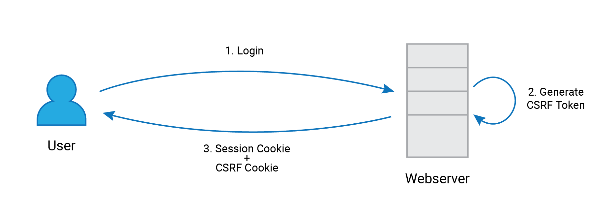
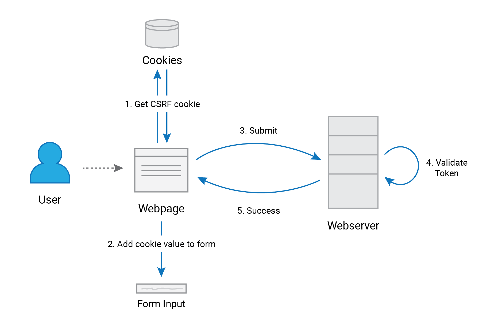

# Double Submit Cookies

**Double submit cookie** is a technique used to mitigate **cross-site request forgery** attacks. In this technique, a CSRF token is generated, and is stored in a cookie on the user's browser. The cookie's value is read and inserted into forms as a hidden value. This value is then validated with the CSRF token value server-side.

When the user logs in a random number is generated as the CSRF token for the session. This token is then stored as a cookie in the browser with the session cookie. 

When the user vists a page with a form, the CSRF cookie is read using Javascript, and it's value is added to the form as a hidden input. When the user submits the form, the CSRF token is also sent with the request. The server then compares the cookies recieved with the request and checks if the form value matches the cookie value. If they match, the request is successful.

If an attacker tries to send a CSRF request, they will be unable to access user's cookies due to the "same-origin policy" enforced by the web browser. Therefore, the attackers requests will not be accepted by the server.

By using this method, server-side processing is reduced, and the browser does not have to make AJAX requests on the user's behalf, unlike in the *synchronizer token pattern*. 

## Tasks
Implement a web application that matches following criteria.

- [x] User login. You may use hard coded user credentials for demonstration purpose.

- [x] Upon login, generate session identifier and set a cookie in the browser. At the same time, generate the CSRF token for the session and set a cookie in the browser. The CSRF token value is not stored in the server side.

- [x] Implement a webpage that has a HTML form. The method should be POST and action should be another URL in the website.

- [x] When the HTML form is loaded, run a javascript which reads the CSRF token cookie value in the browser and add a hidden field to the HTML form modifying the DOM.

- [x] When the form is submitted to the action, the CSRF token cookie will be submitted and also in the form body, the CSRF token value will be submitted.

- [x] In the web page that accepts the form submission (the URL of the action), obtain the CSRF token received in the cookie and also in the message body. Compare the two values received and if they match, show success message. If not show error message.
